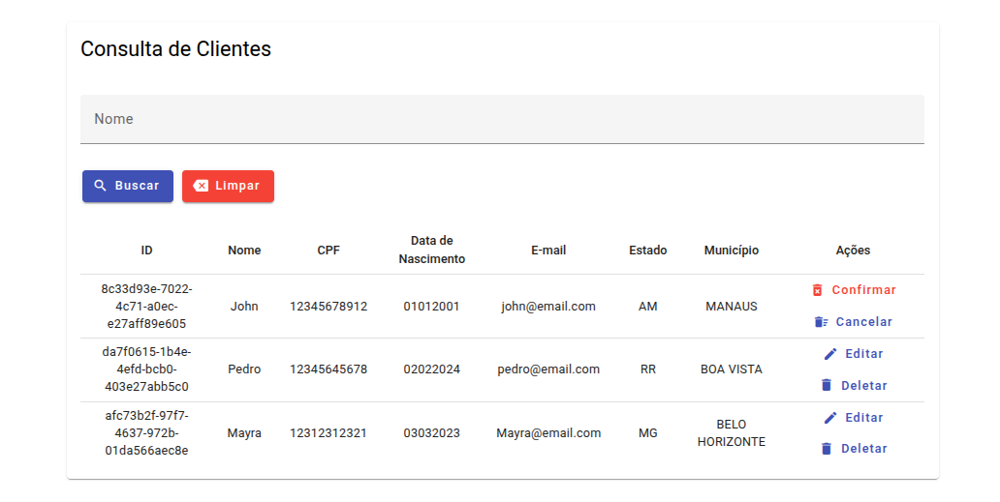

# User Manager App in Angular 19,

This is a User Manager app developed in angular 19.

With this application you will be able to save data, list, edit and delete users data from the Local Storage.

You can access the app by <a href=""><strong>clicking here</strong></a>.

### Functional Requirements:
- Register a User,
- Load State and City data from an external API
- View the list of Users,
- Search for a especific User,
- Update Userdata,
- Remove Userdata,

### Non-Functional Requirements and Styling:
- Save and Retrieve data from LocalStorage,
- Load City data according to the selected State,
- Search and retrieve all users who had the search term,
- Use the same Form Component to Register or Update data,



### Skills:
- Angular Material Forms and Icons
- Conditional Render (@if)
- Repetition (@for)
- CRUD (Create, Read, Update and Delete)
- SCSS
- Routes, Dinamic Routes and Params Query
- LocalStorage
- Components Life Cicle
- Http Fetch
- Observable and Subscribe
- SnackBar (For dinamic text feedback)
- Numbers Mask (Ex: "123.123.123-12" or "01/01/1111")

---

This project was generated using [Angular CLI](https://github.com/angular/angular-cli) version 19.2.4.

## Development server

To start a local development server, run:

```bash
ng serve
```

Once the server is running, open your browser and navigate to `http://localhost:4200/`. The application will automatically reload whenever you modify any of the source files.
